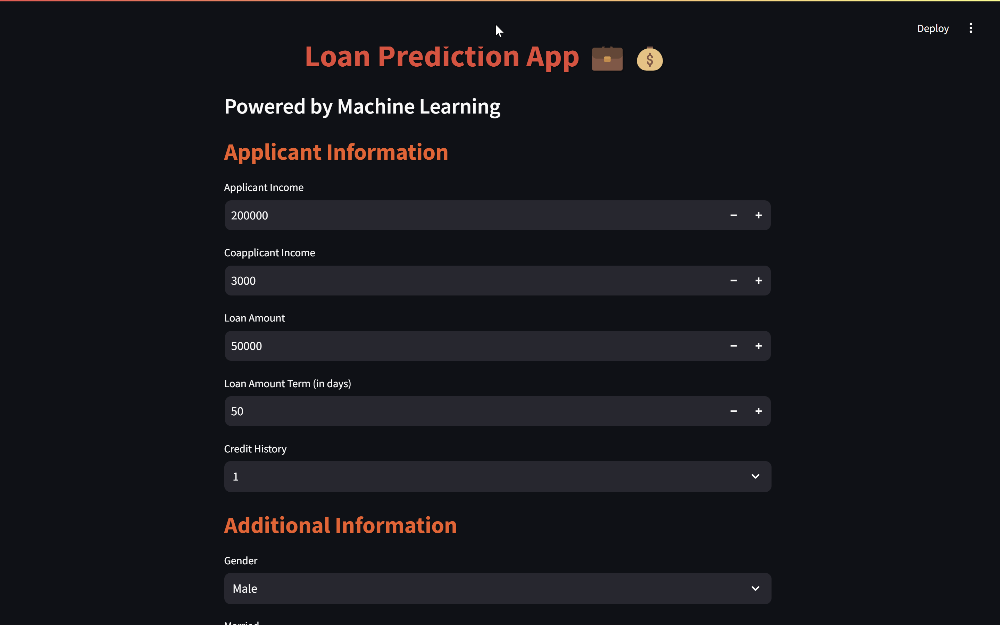
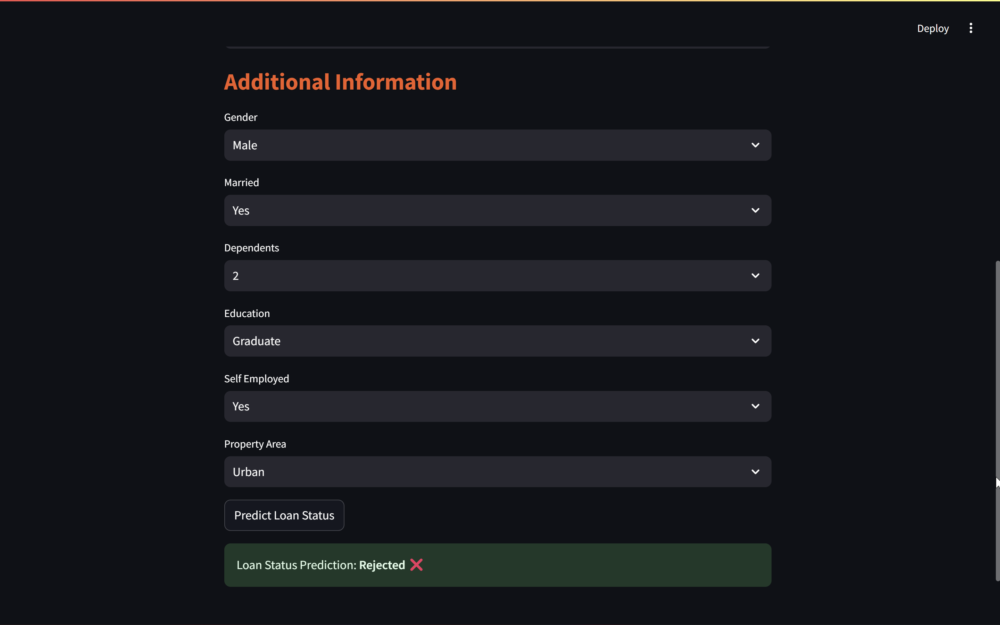

# Loan Approval Prediction App

## Overview
The **Loan Approval Prediction App** is a web-based application built using Streamlit that allows users to predict the approval status of a loan application based on various input features. Utilizing machine learning algorithms, specifically the AdaBoost classifier, this app provides insights into whether an applicant is likely to receive loan approval or not.

### Features
- **User-Friendly Interface**: The app has a clean and intuitive design, making it easy for users to input their information.
- **Real-time Predictions**: Users can receive immediate feedback on their loan application status after inputting their details.
- **Interactive Visuals**: The application includes vibrant colors, animations, and hover effects that enhance user experience.

### Input Features
Users are required to provide the following information:
- Applicant Income
- Coapplicant Income
- Loan Amount
- Loan Amount Term (in days)
- Credit History (1: Good, 0: Bad)
- Gender (Male/Female)
- Marital Status (Married/Not Married)
- Number of Dependents (0, 1, 2, 3+)
- Education Status (Graduate/Not Graduate)
- Employment Status (Self-Employed/Not Self-Employed)
- Property Area (Urban/Semiurban/Rural)

### How It Works
1. **Data Input**: Users fill out the required fields in the app.
2. **Model Prediction**: Once the user clicks the "Predict Loan Status" button, the app processes the input data and generates a prediction using the trained AdaBoost model.
3. **Results Display**: The app displays whether the loan application is **Approved** or **Rejected**, providing users with valuable information to make informed decisions.

### Installation
To run this application locally, follow these steps:
1. Clone the repository:
   ```bash
   git clone https://github.com/yourusername/loan-approval-prediction.git
   cd loan-approval-prediction

2. Install the required packages:
   ```bash
   pip install streamlit scikit-learn

3. Run the Streamlit app:
   ```bash
   streamlit run app.py

### Screenshots
Here are some screenshots of the project:





### Conclusion
The Loan Approval Prediction App is a practical demonstration of applying machine learning to real-world problems. It empowers users with the knowledge to understand their loan eligibility and makes the application process more efficient.